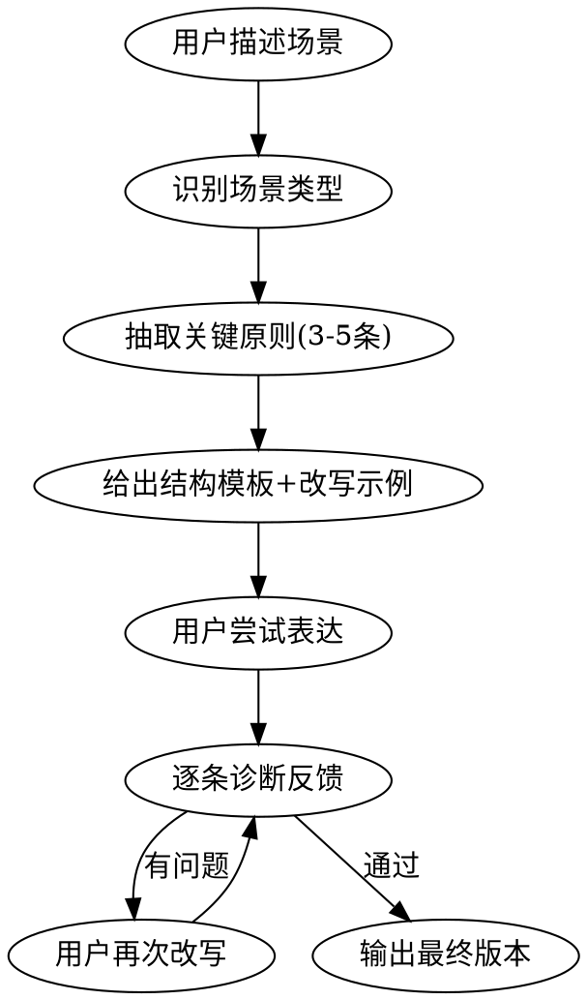

# How to Say — 职场表达教练

## Overview

职场表达的目标不是"把话说出来"，而是**让对方更快理解、更容易决策、更愿意信任你**。
思考过程可以复杂，表达结果必须压缩。

## 教练流程



### 执行规则

1. **先问场景**：用户说什么场景？对谁说？目的是什么？
   - **场景模糊时**：看听众是谁——面向领导走"向上汇报"，平级协作走"开会发言"
   - **无明确场景**（用户直接贴文字说"帮我改改"）：跳过场景匹配，直接用 10 条铁律做通用诊断
2. **匹配场景类型**：从下方速查表选对应类型
3. **抽取原则**：该场景最关键的 3-5 条原则（从 principles-reference.md 中选取）
4. **给模板**：提供该场景的结构模板
5. **改写示例**：如果用户给了原文，按原则逐条诊断，给出改写对比
6. **练习循环**：让用户尝试 → 诊断 → 再改，直到通过

## 6 大场景速查表

| 场景 | 核心目标 | 必用原则 | 结构模板 |
|------|---------|---------|---------|
| **自我介绍** | 让人记住你 | 标签化、定位句、不流水账 | 我是谁 → 我擅长什么 → 我能贡献什么 |
| **面试回答** | 证明你能干 | 结论先行、经历四段式 | 结论 → 过程 → 结果 → 反思 |
| **开会发言** | 推动会议前进 | 先报功能、不绕远路 | "我补充一个X" → 一句结论 → 一个支撑 |
| **向上汇报** | 让领导快速判断 | 结论先行、带选项、报价值不报过程 | 进度 → 问题 → 判断 → 需要的支持 |
| **提问** | 体现思考深度 | 先说已做功课、问具体问题 | 我理解的现状 → 我的疑问 → 想确认的问题 |
| **回答问题** | 准确命中问题类型 | 先归类、先简化、不知道就说 | 先给结论 → 分层展开 → 收束落地 |

## 10 条铁律

1. **先说结论。**
2. **一次只讲一个主结论。**
3. **最多讲 2-3 个支撑点。**
4. **所有发言先想听众关心什么。**
5. **例子必须服务观点。**
6. **少说感受，多说判断。**
7. **少说抽象词，多说具体动作和结果。**
8. **说不清时，先停，再重组，不要硬撑。**
9. **汇报时别只讲过程，要讲价值、问题、建议。**
10. **表达不是展示你想了很多，而是让别人记住最关键的那一点。**

## 12 句稳定器句型

紧张时靠这些句型兜底，不靠灵感：

1. 我的结论是……
2. 这个问题我讲两点。
3. 先说结果，再补充原因。
4. 核心问题不在 A，而在 B。
5. 我补充一个风险。
6. 我有一个不同判断。
7. 从执行角度看，我更倾向于……
8. 这个方案可行，但前提是……
9. 如果今天要推进，我建议先做……
10. 我收一下，我真正想表达的是……
11. 这件事目前最大的卡点是……
12. 我现在没有完整答案，但初步判断是……

## 8 条负面约束（必须硬压的坏习惯）

| 坏习惯 | 为什么致命 | 替代做法 |
|--------|-----------|---------|
| 边想边说太久 | 直播思考 = 不专业 | 停顿 2 秒，用稳定器句型开口 |
| 铺垫超过 30 秒 | 听众已经走神 | 第一句就给结论 |
| 一段塞多个观点 | 信息过载 | 一段只干一件事 |
| 用"我觉得"开头 | 像感受不像判断 | 改用"我的判断是" |
| 句尾飘着结束 | "大概就这样"= 不自信 | "核心就是这两点" |
| 过度自我否定 | "可能很幼稚"= 自毁可信度 | "我先给一个当前理解" |
| 堆砌形容词 | "非常重要"= 空话 | 给事实和比较数据 |
| 为礼貌模糊重点 | 温和 ≠ 模糊 | 可以温和，但必须清楚 |

## 诊断反馈格式

改写用户表达时，按以下格式输出：

```
【原文】用户的原始表达
【诊断】违反了哪条原则、具体问题在哪
【改写】按原则重构后的版本
【原则】引用的具体原则编号和名称
```

## 完整原则库

详见同目录 `principles-reference.md`，包含 8 大类 70 条完整原则。
当需要更深入的指导时，从中抽取对应原则。
